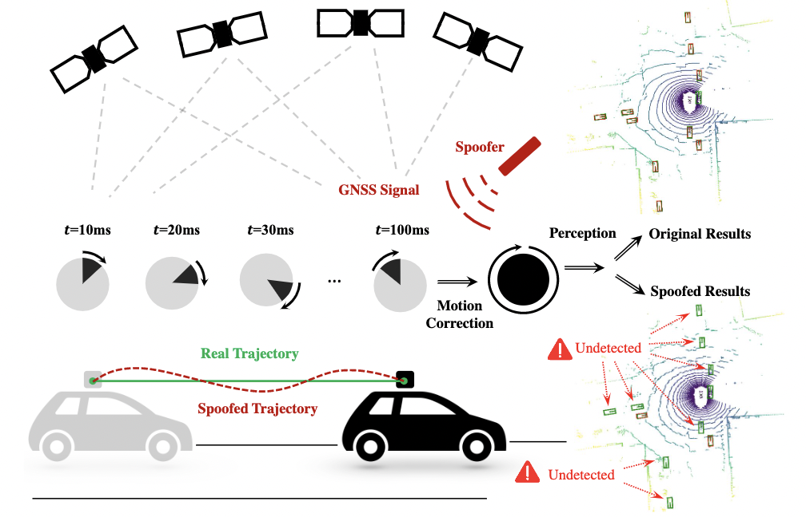

# FLAT: Fooling LiDAR Perception via Adversarial Trajectory Perturbation

Small perturbations to vehicle trajectory can blind LiDAR perception.

<p align="center">  </p>

<p align="left">  </p>
<p align="right">  </p>
Original Detections vs Detections after attack
Green/red boxes denote groundtruth/predictions respectively.

> [**Fooling LiDAR Perception via Adversarial Trajectory Perturbation**](https://arxiv.org/abs/2103.15326)        
> Yiming Li, Congcong Wen, Felix Juefei-Xu, Chen Feng        
> [arXiv 2006.11275](https://arxiv.org/abs/2103.15326)

## News

[2021-07] FLAT is accepted at ICCV 2021 as oral presentation

## Abstract
LiDAR point clouds collected from a moving vehicle are functions of its trajectories, because the sensor motion needs to be compensated to avoid distortions. When autonomous vehicles are sending LiDAR point clouds to deep networks for perception and planning, could the motion compensation consequently become a wide-open backdoor in those networks, due to both the adversarial vulnerability of deep learning and GPS-based vehicle trajectory estimation that is susceptible to wireless spoofing? We demonstrate such possibilities for the first time: instead of directly attacking point cloud coordinates which requires tampering with the raw LiDAR readings, only adversarial spoofing of a self-driving car's trajectory with small perturbations is enough to make safety-critical objects undetectable or detected with incorrect positions. Moreover, polynomial trajectory perturbation is developed to achieve a temporally-smooth and highly-imperceptible attack. Extensive experiments on 3D object detection have shown that such attacks not only lower the performance of the state-of-the-art detectors effectively, but also transfer to other detectors, raising a red flag for the community. 

# Installation
## Requirements
We performed our code on [PointRCNN](https://github.com/sshaoshuai/PointRCNN)
* Linux (tested on Ubuntu 16.04)
* Python 3.7+
* PyTorch 1.2.0
* CUDA 10.0

## Create Anaconda Environment
```bash
conda create -n flat
conda activate flat
pip install torch==1.2.0 torchvision==0.4.0
git clone https://github.com/ai4ce/FLAT.git
cd FLAT/PointRCNN
sh build_and_install.sh
cd ..
pip install -r requirements.txt
```

# Dataset preparation
We modified the official [nuscenes-devkit script](https://github.com/nutonomy/nuscenes-devkit/blob/master/python-sdk/nuscenes/scripts/export_kitti.py) to generate kitti-format nuscenes dataset with ego pose for interpolation.

Please download the official [nuscenes dataset](https://www.nuscenes.org/nuscenes)(v1.0-trainval)

Use ```nusc_to_kitti.py``` to generate the dataset.

```bash
python nusc_to_kitti.py nuscenes_gt_to_kitti --[dataroot "Your nuscenes dataroot"]
```

It will generate the dataset in the structure as follows.
```
FLAT
├── dataset
│   ├── nusc_kitti
│   │   ├──val_1000
│   │   │   ├──image_2
│   │   │   ├──ImageSets
│   │   │   ├──label_2
│   │   │   ├──pose
│   │   │   ├──velodyne
```

*NOTICE*: We defaulty use the first 1000(of 6019 in total) samples from orginal validation split of v1.0-trainval. You can use all of the nuscenes samples, and shuffle option is also provided.

# Run FLAT On Evaluation
We modify the evaluation code of PointRCNN, for implementing FLAT.

For AP calculation, we borrowed the evaluation code from [Train in Germany, Test in The USA: Making 3D Object Detectors Generalize](https://github.com/cxy1997/3D_adapt_auto_driving), utilizing distance-based difficulty metrics.

```bash
python flat.py [--stage STAGE] [--nb_iter NB_ITER]
               [--task TASK] [--attack_type ATTACK_TYPE] 
               [--iter_eps ITER_EPS] [--iter_eps2 ITER_EPS2] [--poly]
```

```
--split SPLIT         The data split for evaluation
--stage STAGE         Attack stage of Point RCNN. Options: "1" for RPN
                    stage, "2" for RCNN stage
--nb_iter NB_ITER     Number of attack iterations in PGD
--task TASK           Task of attacking. Options: "cls" for classification,
                    "reg" for regression
--attack_type ATTACK_TYPE
                    Specify attack type. Options: "all", "translation",
                    "rotation"
--iter_eps ITER_EPS   Primary PGD attack step size for each iteration, in
                    translation only/rotation only attacks, this parameter
                    is used.
--iter_eps2 ITER_EPS2
                    Secondary PGD attack step size for each iteration,
                    only effective when attack_type is "all" and poly mode
                    is disabled.
--poly                Polynomial trajectory perturbation option. Notice: if
                    true, attack_type will be fixed(translation)
```


# Citation
```
@InProceedings{Li_2021_ICCV,
      title = {Fooling LiDAR Perception via Adversarial Trajectory Perturbation},
      author = {Li, Yiming and Wen, Congcong and Juefei-Xu, Felix and Feng, Chen},
      booktitle = {Proceedings of the IEEE/CVF International Conference on Computer Vision (ICCV)},
      month = {October},
      year = {2021}
}
```